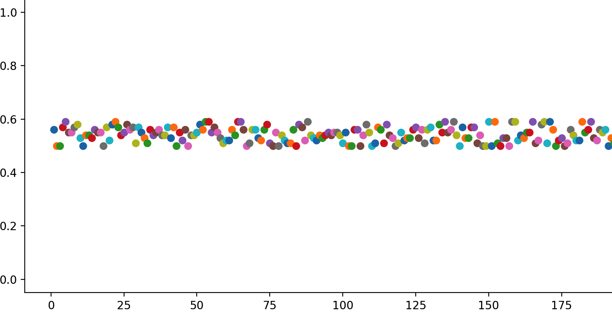

# Target Based Auto Scaler
To create a target based auto scaler, you specify a metric and targeted maximum and minimum metric values that represent the ideal average utilisation or throughput level for your application. Auto Scaler can then scale out your group (add more replicas) to handle peak traffic and scale in your group (run fewer replicas) to reduce costs during periods of low utilisation or throughput.

For example, let's say that you currently have an application that runs on two replicas, and you want the CPU utilisation to stay at around 50–80 percent when the load on the application changes. This gives you extra capacity to handle traffic spikes without maintaining an excessive number of idle resources.

You can meet this need by setting a target for scale-out and scale-in thresholds that targets an average CPU utilisation of 50 to 80 percent. Then, the auto-scaler scales the number of replicas to keep the actual metric value between 50 and 80 percent.

Auto Scaler continuously checks metric threshold values you configure (note: The default check interval is 60 seconds, and this can be altered as per our requirement using the `autoscale_engine_runs_every`) and if the current threshold is higher than the specified threshold, Auto Scaler attempts to increase the number of replicas. 
Auto Scaler assumes a linear relationship between the metric and the number of replicas. It operates on the ratio between the desired metric value and the current metric value. The formula used to compute the desired replicas is as follows:

```bash
desired_replicas = ceil[current_replicas * (current_matric_value / desired_matric_value)]
```
## Documentation

* [Installation](#installation)
* [Getting Started](#getting-started)
  - [Configurations](#1-configurations)
    - [Effective Configurations Values](#11-effective-configurations-values)
    - [User Configuration](#12-user-configuration)
    - [System Configuration](#13-system-configuration)
    - [Important Configuration Settings](#14-important-configuration-settings)
  - [Run Auto Scaler](#2-run-auto-scaler)
* [Features](#features)
  - [Cool-Down Period](#1-cool-down-period)
  - [Flapping Protection](#2-flapping-protection)
    - [Reasonsn Behind Flappling](#flapping-is-often-caused-by)
    - [How Auto-Scaler Avoid Flapping](#how-auto-scaler-avoids-flapping)
    - [Sample Logs How Auto-Scaler Avoid Flapping](#sample-logs)
  - [Min-Max Limits to Control your Budget](#3-min-max-limits-to-control-your-budget)
      - [Minimum Capacity](#31-minimum-capacity)
      - [Maximum Capacity](#32-maximum-capacity)
  - [Auto Retries on API Failures](#4-auto-retries-on-api-failures)
  - [Multiple Retry Stratigies](#5-multiple-retry-strategies)
    - [Plain Retry after a Fixed Interval](#51-plain-retry-after-a-fixed-interval)
    - [Retry with Exponetial Back-Offs](#52-retry-with-exponetial-back-offs)
    - [Retry with Added Randomness](#53-retry-with-added-randomness)
  - [Protection Againste Thundering Herd](#6-protection-against-thundering-herds)
* [Force to Ignore CoolDown](#force-to-ignore-cooldown)
* [Previous Test Builds](https://github.com/AkshaySiwal/auto-scaler/actions/)
* [See Runtime Values](#Want-to-check-what-configuration-values-the-auto-scaler-has-picked)
* [Graphs](#graphs)
* [Notes for Users](#notes-for-users)
* [To Do](#to-do)


## Installation
Clone this repository and install all the required packages as given below:
```bash
git clone https://github.com/AkshaySiwal/auto-scaler.git
cd auto-scaler/
pip install -r requirements.txt
```

## Getting Started
You can define custom configuration values and start the auto-scaler.

### 1. Configurations
You can fine-tune autoscale by providing a configuration that suits your requirements. If the user does not provide any configuration, then it uses the system default values.
modules/settings.py evaluates user-given configuration and system defaults and generates effective configuration values.

#### 1.1. Effective Configurations Values
Autoscaler uses `modules/settings.py` to evaluate user-given configuration and system defaults to generate effective configuration values.
Autoscaler uses these configurations to generate effective configurations:
- [User configuration](etc/user_settings.cfg)
- [System configuration](etc/system_settings.cfg)

#### 1.2. User Configuration
All [user configurations](etc/user_settings.cfg) are defined in `modules/user_settings.py`. If the user fails to provide any parameters in this file, it uses the system [default](etc/system_settings.cfg) settings.

#### 1.3. System Configuration
All [system default configurations](etc/system_settings.cfg) are defined in `modules/system_settings.py`.

#### 1.4. Important Configuration Settings
There are no required configurations. If the user does not provide any value to the configuration settings, it will inherit system defaults. To override the system default, set these settings in the [user configuration file](etc/user_settings.cfg).
```bash

# System Default values

app_status_host='localhost'
app_status_port=8123
app_status_read_url='/app/status'
app_replica_update_url='/app/replicas'
read_metrics_key = 'cpu.highPriority'
read_replicas_key = 'replicas'
app_status_secure=False
app_connection_timeout=10
target_avg_cpu_utilization_for_scale_out = 0.80 # Ranges 0-1.0
target_avg_cpu_utilization_for_scale_in = 0.50 # Ranges 0-1.0
autoscale_engine_runs_every = 60 # Seconds
cool_down_time_seconds = 15 # Seconds
max_replicas=1000
min_replicas=0
debug_logs=False
```

### 2. Run Auto Scaler

```bash
python main.py
```

## Features
### 1. Cool-Down Period
The auto-scaler uses a cool-down period. This period is the amount of time to wait after a scale operation before scaling again. The cool-down period allows the metrics to stabilise and avoids scaling more than once for the same condition. Cool-down applies to both scale-in and scale-out events. For example, if the cooldown is set to 10 minutes and Auto-scaler has just scaled-in, Auto-scaler won't attempt to scale again for another 10 minutes in either direction.

Suppose, for example, that a simple scaling policy for CPU utilisation recommends launching two replicas. Auto-Scaler launches two replicas and then pauses the scaling activities until the cooldown period ends. After the cooldown period ends, any scaling activities can resume. If CPU utilisation breaches the alarm-high threshold again, the auto-scaler scales out again, and the cooldown period takes effect again. However, if two replicas were enough to bring the metric value back down, the group would remain at its current size.
See `cool_down_time_seconds` in the configurations.

_**NOTE:**_ The cool-down period should be proportionate to the application start-up time to prevent the auto-scaler from scaling while replicas from previous scale-out operations are still in the startup phase.


### 2. Flapping Protection
Flapping refers to a loop condition that causes a series of opposing scale events. Flapping happens when one scale event triggers an opposite scale event. For example, scaling-in reduces the number of replicas, causing the CPU to rise in the remaining replicas. This in turn triggers a scale-out event, which causes CPU usage to drop, repeating the process.

To ensure adequate resources, checking for potential flapping doesn't occur for scale-out events. Auto-scaler will only defer a scale-in event to avoid flapping.


For example, let's assume the following rules:

- Scale-out by increasing by 1 replica when average CPU usage is above 50%.
- Scale-in by decreasing the replica count by 1 replica when average CPU usage is lower than 30%.
In the table below at T0, when usage is at 56%, a scale-out action is triggered, resulting in 56% CPU usage across 2 replicas. That gives an average of 28% for the scale set. As 28% is less than the scale-in threshold, the auto-scaler should scale back in. Scaling in would return the scale set to 56% CPU usage, which triggers a scale-out action. If left uncontrolled, there would be an ongoing series of scale events.

| Time | Replica count| CPU% | CPU% per replica | Scale event | Resulting instance count |
| :---: | :---: | :---: | :---: | :---: | :---: |
| T0 | 1 | 56% | 56% | Scale out | 2 |
| T1 | 2 | 56% | 28% | Scale in  | 1 |
| T2 | 1 | 56% | 56% | Scale out | 2 |
| T2 | 2 | 56% | 28% | Scale in  | 1 |

#### Flapping is often caused by:

- Small or no margins between thresholds
- Scaling by more than one instance
- Scaling in and out using different metrics

#### How Auto-Scaler Avoids Flapping 
To avoid flapping when scaling-in by more than one instance, autoscale may scale by less than the number of desired replicas.

For example, the following rules can cause flapping:

- Scale-out when CPU > 70% per instance.
- Scale-in when the request CPU <=50% per instance.

The table below shows a potential outcome of these auto-scale rules:

| Time | Replica count| Desired Replica count| CPU% | Scale event | Resulting instance count | Comments |
| :---: | :---: | :---: | :---: | :---: | :---: |:---: |
| T0 | 16 | 11 | 48% | Scale in by 4 replicas | 12  | Scaling-in by 5 would cause an estimated CPU rise >= 70%, leading to a scale-out event. |


At T0, when the CPU usage is 48% per replica, auto-scale will try to scale in by 5 replicas to have 11 desired replicas. However, autoscale estimates that the CPU load for 11 replicas will be >= 70%, causing a scale-out event.

To avoid flapping, the autoscale engine estimates the CPU usage for replica counts above 11 until it finds an instance count where all metrics are within the defined thresholds:

- Keep the CPU below 70%.
- Keep the CPU above 50%.

In this situation, the auto-scaler may scale in by 4, from 16 to 12 replicas, in order to satisfy the rules, even though the rule specifies a decrease of 5. A log message is written to the console, and a log file with a description that includes scale down will occur with an updated replica count to avoid flapping.

If auto-scaler can't find a suitable number of instances, it will skip the scale-in event and reevaluate during the next cycle.

#### Sample Logs
```bash
http://192.168.58.2:8123/app/status returned 200, Avg CPU: 0.48, Replicas: 16
Desired replicas: 11, Current replicas: 16, Min replicas: 10, Max replicas: 100
Reading cooldown .cooldown_time.lock lock file.
No need to cooldown, last scale action executed 8 secs before (cooldown: 0 secs)
Auto-scaler is checking...
Desired replicas 11 must be between min: 10, max: 100
Checking if scale-in can potentially cause flapping...
Effective Avg CPU after Scale-in: 0.7 (CPU: 0.5-0.7), Purposed desired replicas: 11
Scaling-in to 11 can make Avg CPU: 0.7 (>= 0.7)
Scaling-in to 11 is ignored by the auto-scaler to avoid flapping.
* Re-calculating effective CPU after scale-in with replicas: 12 (+1) (11->12) *
Effective Avg CPU after Scale-in: 0.64 (CPU: 0.5-0.7), Purposed desired replicas: 12
Effective Avg CPU after Scale-in: 0.64 (CPU: 0.5-0.7), Verified desired replicas: 12
Scale-in is required by delta: -4 (16->12)
Scaling-in by delta: -4 (16->12)
http://192.168.58.2:8123/app/replicas returned 204, Scaled to replicas: 12
Next check will be after 1 seconds.
```

### 3. Min-Max Limits to Control your Budget
Scaling limits represent the minimum and maximum replica sizes that you want for your application. You set limits separately for the minimum and maximum size.

The application's desired capacity can be resized to a number that's within the range of your minimum and maximum size limits. The desired capacity must be equal to or greater than the minimum group size and equal to or less than the maximum group size.

#### 3.1. Minimum Capacity
Represents the minimum replica size. Auto-scaler cannot decrease the application's desired capacity lower than the minimum capacity. Check `max_replicas` to cutomize it.
If the user does not provide any value for `max_replicas` auto-sclaer will inharite the system default `1000`.

#### 3.2. Maximum Capacity
Represents the maximum replica size. Auto-scaler cannot increase the application's desired capacity higher than the maximum capacity. Check `min_replicas` to cutomize it.
If the user does not provide any value for `min_replicas` Auto-sclaer will inharite the system default `0`.

### 4. Auto-Retries on API Failures
Auto-scaler is configured to retry multiple times (can be configured with settings; default is `3`) on failure.
By default, it retries only after server-side errors (5XX) and connection errors, but you can change this behaviour. Check `retry_on_http_codes`, `retry_on_connection_error` and `api_retries_count`.


### 5. Multiple Retry Strategies


#### 5.1. Plain Retry After a Fixed Interval
Auto-scaler will wait for a pre-configured interval of time and retry again after a fixed interval (Check `retry_after_seconds`)  based on how many retries have been configured. (Check `api_retries_count`)
If not provided, it will use the system default values. `retry_after_seconds=2` and `api_retries_count=3`


#### 5.2. Retry with Exponetial Back-Offs
Retrying after a fixed interval of time can be problematic some times, especially when your app status service just comes up after a recent breakdown or restarts and gets flooded with queued requests. Check `retry_exponentially`; this will retry the app status service after the added exponential back-off time.
This is enabled by default instead of retrying after a fixed time. Check `retry_exponentially`. To disable it, set it to false (`retry_exponentially=False`).


#### 5.3. Retry with Added Randomness
Auto-scaller suppoorts retry after a fixed time as well as exponetial backed-off retries. The `retry_add_randomness` adds extra randomness in the wait interval to make retry attempts more reliable. This is enabled by default; set `retry_add_randomness=False` to disable it.

### 6. Protection Against Thundering Herds
Retries with exponential backoff with added randomness go easy on dependent services and help them recover after a recent breakdown or restart.

## Force to Ignore CoolDown
Auto-scaler by default generally does not perform any scalling activity until the cooldown period has expired.
If you want to force Auto-scaler to ignore the cooldown period for some testing, then you can do so by deleting the cooldown lock file `.cooldown_time.lock`. Please note that it will only let Auto-scaler Ignore cool down once.

## Want to Check what Configuration values the Auto-Scaler has picked?
When you start the auto-scaler, it dumps its effective configuration in file `etc/configs.cfg` to help you debug.

## Graphs
You can run [graph.py](graph.py) in a separate terminal to plot a graph to see how metrics behave with scaling activities.


## Notes For Users
- Avoid setting the `target_avg_cpu_utilization_for_scale_out` too high if your application takes a long time to start, as in this case the CPU is already high and might increase even further. Your users might notice some slowness until new replicas come live.
- The cool-down period `cool_down_time_seconds` should be proportionate to the application start-up time to prevent the auto-scaler from scaling while replicas from previous scale-out operations are still in the startup phase.

## To Do
- Add a user configuration validator to verify the data-type of input configuration. However, code is designed in a way to adopt the best scenario in case the user provides the wrong input configuration, but it is good to have a configuration validator and have it run before actual logic starts.
- Refactor code and remove unnecessary lines.
- Add more test coverage
- Add Graph from a seprate file to main.py to have real-time view.

